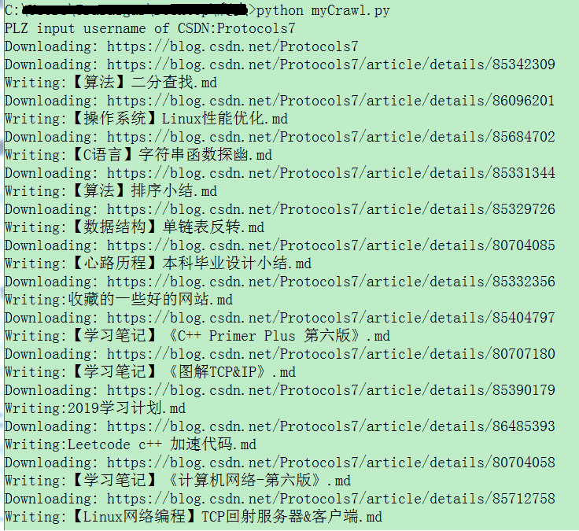
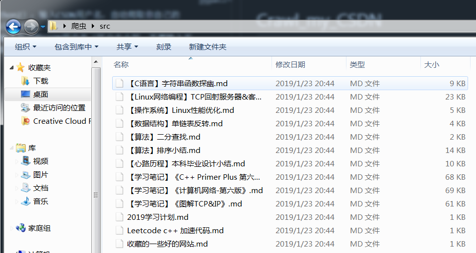

# Crawl_my_CSDN
 一个非常简单的爬虫程序（python2）：输入CSDN用户名，自动爬取你自己的CSDN博客，以markdown格式保存到本地。 
 使用方法：运行python脚本，输入自己的CSDN用户名（区分大小写、不要输入无关字符），就会自动下载在脚本所在文件夹中的src文件夹。 
 示例： 
 
 测试环境：win7，python2
 说明：脚本是为了练习写出来了的，非常粗糙，有太多地方需要改进。

